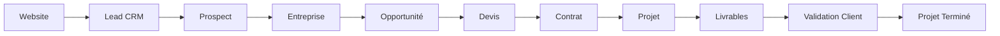

# User Flows — Zawena Platform

> Produit : Zawena Platform
>
> Document : User Flows Index
>
> Version : 1.0
>
> Statut : Draft
>
> Dernière mise à jour : 02 Août 2026
>
> Propriétaire : Product Management – Zawena

---

# Table des matières

1. Objectif
2. Vue d'ensemble
3. Classification des User Flows
4. Relations entre les parcours
5. Organisation de la documentation
6. Cycle de vie global
7. Références

---

# 1. Objectif

Ce document constitue l'index officiel des User Flows de Zawena Platform.

Il offre une vue d'ensemble des parcours utilisateurs documentés et indique où trouver les spécifications détaillées.

Les descriptions complètes sont disponibles dans :

```
docs/product/user-flows/
```

---

# 2. Vue d'ensemble

Les User Flows décrivent le parcours des utilisateurs lors de l'utilisation de la plateforme.

Ils complètent :

- les Functional Requirements ;
- les Feature Specifications ;
- les User Stories ;
- les Business Rules ;
- les Acceptance Criteria.

Chaque parcours documente :

- l'objectif ;
- les acteurs ;
- les préconditions ;
- les déclencheurs ;
- les étapes principales ;
- les cas alternatifs ;
- les cas d'erreur ;
- les événements métier ;
- les APIs ;
- les dépendances.

---

# 3. Classification des User Flows

## Website

Document :

```
docs/product/user-flows/visitor.md
```

Principaux parcours :

- Découverte de Zawena
- Consultation des services
- Consultation des réalisations
- Lecture du blog
- Contact
- Demande de devis

---

## Authentication

Document :

```
docs/product/user-flows/authentication.md
```

Parcours :

- Connexion
- Déconnexion
- Mot de passe oublié
- Vérification Email
- Gestion des sessions
- Gestion du profil

---

## Dashboard

Document :

```
docs/product/user-flows/admin.md
```

Parcours :

- Dashboard
- Recherche
- Navigation
- Widgets
- KPIs

---

## CRM

Document :

```
docs/product/user-flows/crm.md
```

Parcours :

- Création d'un Lead
- Qualification
- Conversion Prospect
- Opportunité
- Pipeline
- Activités
- Création d'un devis

---

## Quotes

Document :

```
docs/product/user-flows/quote.md
```

Parcours :

- Création
- Validation
- Envoi
- Acceptation
- Contrat
- Projet

---

## Projects

Document :

```
docs/product/user-flows/projects.md
```

Parcours :

- Création
- Équipe
- Tâches
- Livrables
- Validation
- Clôture

---

## Client Portal

Document :

```
docs/product/user-flows/client.md
```

Parcours :

- Dashboard
- Consultation des projets
- Téléchargement
- Validation
- Notifications

---

## CMS

Document :

```
docs/product/user-flows/cms.md
```

Parcours :

- Création
- Publication
- Médias
- SEO

---

## Notifications

Document :

```
docs/product/user-flows/notifications.md
```

Parcours :

- Génération
- Distribution
- Lecture
- Archivage

---

## Settings

Document :

```
docs/product/user-flows/settings.md
```

Parcours :

- Organisation
- Utilisateurs
- Permissions
- Sécurité
- Branding
- Intégrations

---

# 4. Relations entre les parcours

Les différents User Flows sont liés entre eux.

Exemple :

```
Website

↓

CRM

↓

Quotes

↓

Projects

↓

Client Portal
```

Autre exemple :

```
Authentication

↓

Dashboard

↓

Tous les modules
```

Le moteur de notifications intervient transversalement sur l'ensemble des workflows.

---

# 5. Organisation de la documentation

Chaque document du dossier :

```
docs/product/user-flows/
```

respecte la structure suivante :

- Objectif
- Vue d'ensemble
- Acteurs
- Workflows
- Diagrammes Mermaid
- États métier
- APIs
- KPIs
- Cas alternatifs
- Cas d'erreur
- Dépendances
- Références

---

# 6. Cycle de vie global

Le parcours métier principal de Zawena peut être résumé ainsi :



Ce workflow représente le cycle de vie principal de la plateforme.

Les autres parcours viennent compléter ou enrichir ce processus.

---

# 7. Références

- PRD
- MVP Definition
- Functional Requirements
- Business Rules
- Feature Specifications
- User Stories
- User Flows (dossier)
- Acceptance Criteria