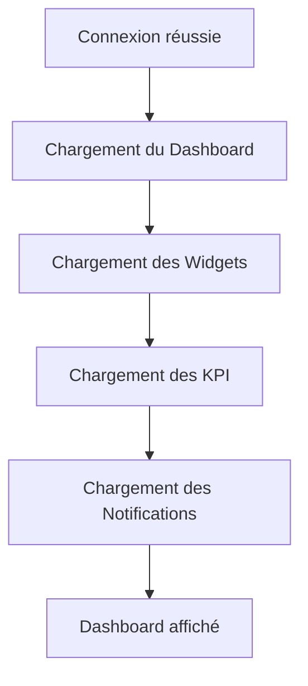
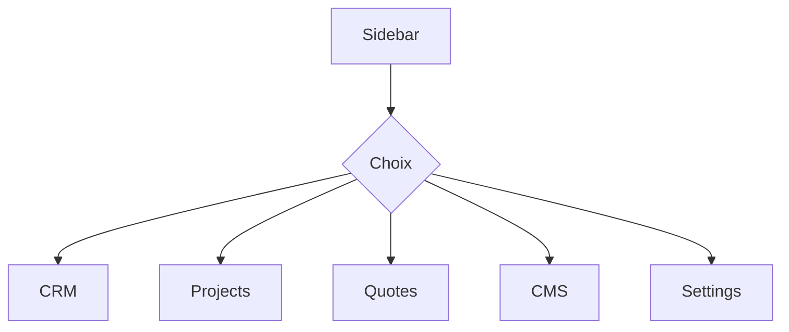
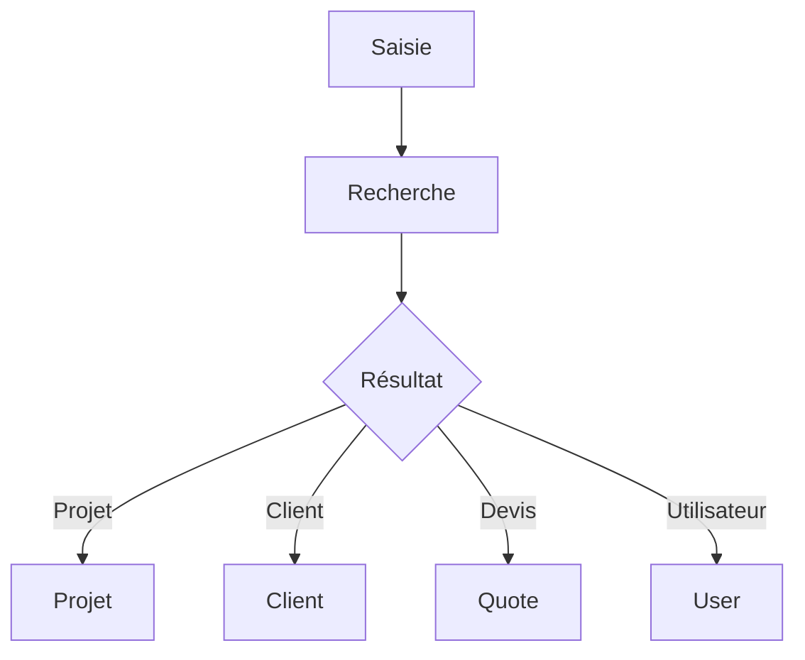
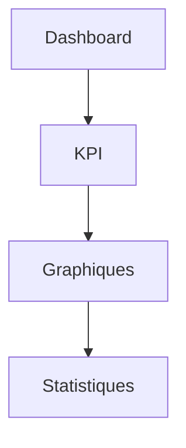
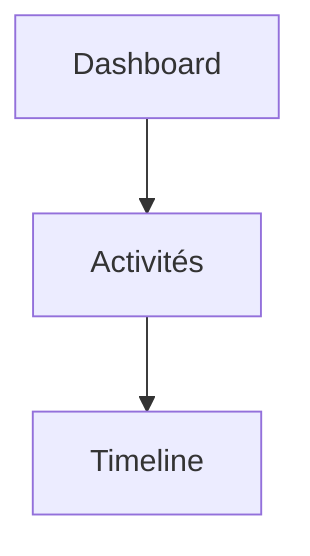
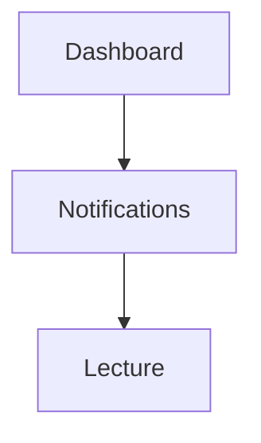
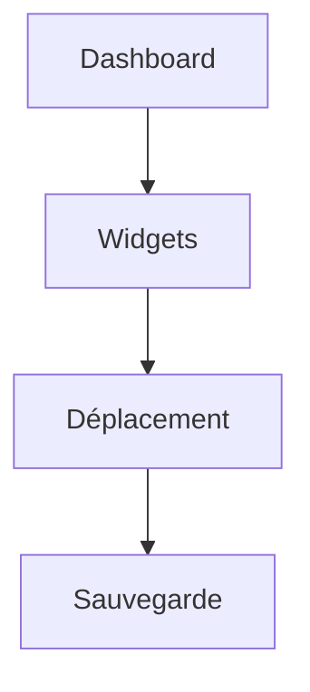

# User Flows — Administration

> Produit : Zawena Platform
>
> Module : Dashboard / Administration
>
> Identifiant : USER-FLOWS-ADMIN
>
> Version : 1.0
>
> Statut : MVP
>
> Dernière mise à jour : 02 Août 2026
>
> Propriétaire : Product Management – Zawena

---

# Table des matières

1. Objectif
2. Vue d'ensemble
3. Acteurs
4. Flows
5. Cas alternatifs
6. Cas d'erreur
7. Dépendances
8. Références

---

# 1. Objectif

Décrire les différents parcours des administrateurs dans le Dashboard de Zawena Platform.

Le Dashboard constitue le point d'entrée principal après authentification.

---

# 2. Vue d'ensemble

Depuis le Dashboard, un administrateur peut :

- consulter les indicateurs ;
- accéder aux modules ;
- consulter les notifications ;
- rechercher une ressource ;
- accéder rapidement aux actions fréquentes.

---

# 3. Acteurs

## Acteur principal

Administrator

## Acteurs secondaires

- Super Administrator
- API
- Base de données
- Notification Engine

---

# 4. Flows

---

# FLOW-ADMIN-001 — Accéder au Dashboard

## Objectif

Afficher une vue synthétique des informations importantes.

### Préconditions

- Utilisateur connecté
- Session valide

### Déclencheur

Connexion réussie.

### Diagramme



### Résultat attendu

Le Dashboard est entièrement chargé.

### APIs

GET /dashboard

GET /notifications

GET /statistics

### Événements

dashboard.loaded

### Notifications

Aucune

---

# FLOW-ADMIN-002 — Naviguer entre les modules

### Diagramme



### API

GET /menu

---

# FLOW-ADMIN-003 — Utiliser la recherche globale

### Diagramme



### API

GET /search

---

# FLOW-ADMIN-004 — Consulter les KPI

### Diagramme



---

# FLOW-ADMIN-005 — Consulter les activités récentes



---

# FLOW-ADMIN-006 — Consulter les notifications



---

# FLOW-ADMIN-007 — Accéder aux raccourcis

```mermaid
flowchart TD

Dashboard

-->

Quick Actions

-->

Module
```

---

# FLOW-ADMIN-008 — Personnaliser le Dashboard



---

# FLOW-ADMIN-009 — Basculer le thème

```mermaid
flowchart TD

Profil

-->

Préférences

-->

Dark Mode

-->

Sauvegarde
```

---

# FLOW-ADMIN-010 — Se déconnecter

```mermaid
flowchart TD

Profil

-->

Déconnexion

-->

Suppression Session

-->

Login
```

---

# 5. Cas alternatifs

## Aucun widget disponible

↓

Afficher un état vide.

---

## KPI indisponible

↓

Afficher uniquement les widgets disponibles.

---

## Recherche sans résultat

↓

Afficher "Aucun résultat".

---

# 6. Cas d'erreur

Erreur API

↓

Message

↓

Nouvelle tentative

---

Erreur réseau

↓

Mode dégradé

---

Session expirée

↓

Retour Login

---

# 7. Dépendances

- docs/product/features/dashboard.md
- docs/product/user-stories/dashboard.md
- docs/architecture/api.md
- docs/design-system/dashboard.md

---

# 8. Références

Dashboard Feature Specification

Dashboard User Stories

Architecture API

Design System

---