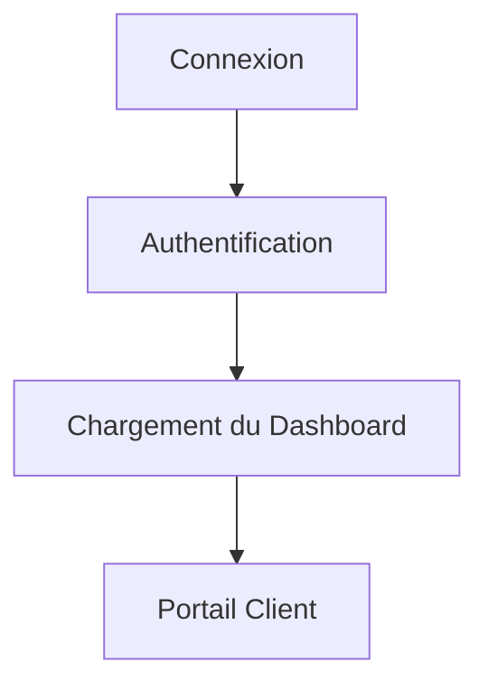
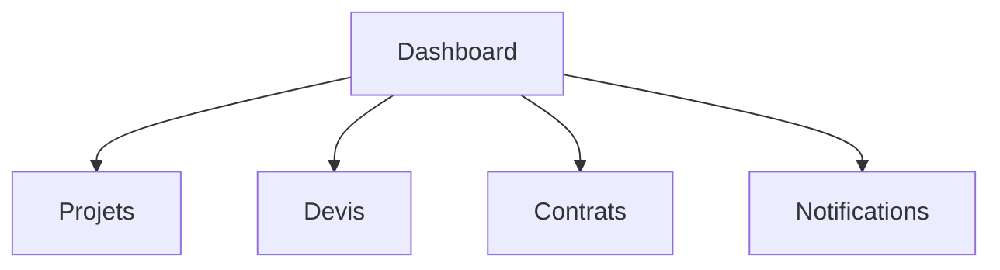
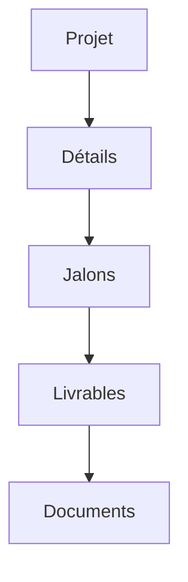
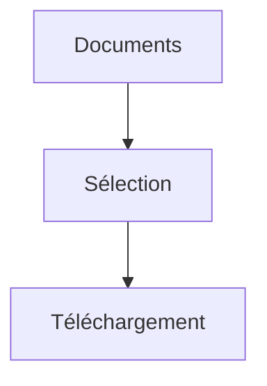
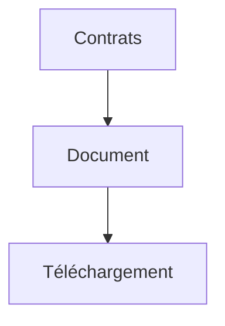
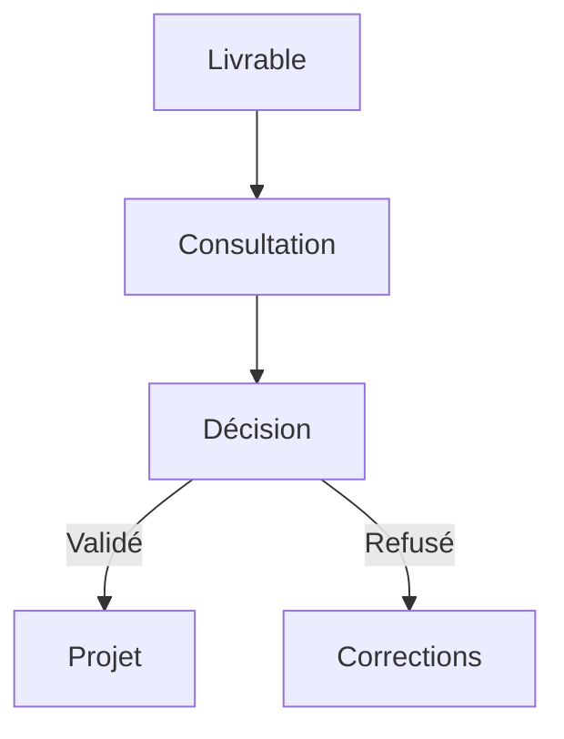
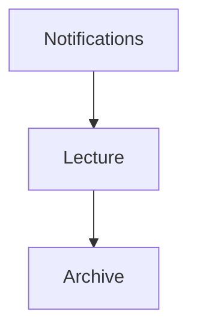
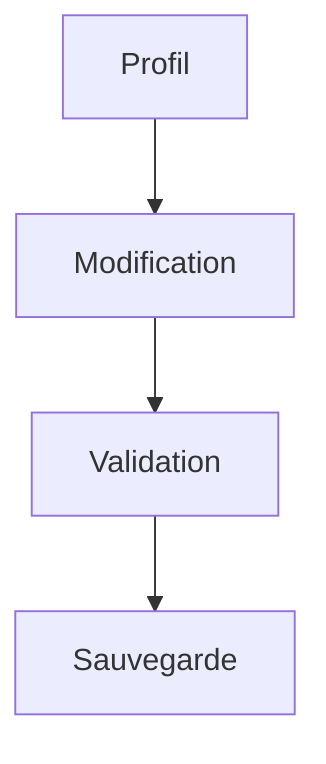

# User Flows — Client Portal

> Produit : Zawena Platform
>
> Module : Client Portal
>
> Identifiant : USER-FLOWS-CLIENT
>
> Version : 1.0
>
> Statut : MVP
>
> Dernière mise à jour : 02 Août 2026
>
> Propriétaire : Product Management – Zawena

---

# Table des matières

1. Objectif
2. Vue d'ensemble
3. Acteurs
4. Workflows
5. Cas alternatifs
6. Cas d'erreur
7. KPIs
8. Dépendances
9. Références

---

# 1. Objectif

Décrire les parcours des clients dans le portail sécurisé de Zawena.

Le portail client centralise toutes les informations relatives aux projets, devis, contrats, documents et livrables.

---

# 2. Vue d'ensemble

Le Client Portal permet de :

- consulter le tableau de bord ;
- suivre les projets ;
- consulter les devis ;
- consulter les contrats ;
- télécharger les documents ;
- valider les livrables ;
- recevoir les notifications ;
- gérer son profil.

---

# 3. Acteurs

## Acteur principal

- Client

## Acteurs secondaires

- Project Manager
- Sales
- Notification Engine
- Projects Module
- Quotes Module
- CMS

---

# 4. Workflows

---

# FLOW-CLIENT-001 — Connexion au portail

## Objectif

Permettre au client d'accéder à son espace sécurisé.

### Préconditions

- Compte actif
- Authentification valide

### Déclencheur

Connexion réussie.

### Diagramme



### États

Déconnecté

↓

Authentifié

↓

Connecté

### APIs

POST /auth/login

GET /client/dashboard

### Événements

client.login

---

# FLOW-CLIENT-002 — Consulter le Dashboard



### APIs

GET /client/dashboard

---

# FLOW-CLIENT-003 — Consulter un projet



### États

En cours

↓

Suspendu

↓

Terminé

---

# FLOW-CLIENT-004 — Télécharger un document



### APIs

GET /documents/{id}

### Événements

document.downloaded

---

# FLOW-CLIENT-005 — Consulter un devis

```mermaid
flowchart TD

Mes devis

-->

Sélection

-->

PDF
```

---

# FLOW-CLIENT-006 — Consulter un contrat



---

# FLOW-CLIENT-007 — Valider un livrable

## Objectif

Permettre au client de valider ou refuser un livrable.

### Diagramme



### États

Soumis

↓

En validation

↓

Accepté

↓

Refusé

### APIs

PATCH /deliverables/{id}/validate

### Événements

deliverable.validated

deliverable.rejected

### Notifications

Project Manager

Developer

---

# FLOW-CLIENT-008 — Consulter les notifications



---

# FLOW-CLIENT-009 — Modifier son profil



---

# FLOW-CLIENT-010 — Cycle de vie client

```mermaid
flowchart TD

Connexion

-->

Dashboard

-->

Projet

-->

Livrable

-->

Validation

-->

Projet terminé

-->

Archivage
```

---

# 5. Cas alternatifs

## Aucun projet actif

↓

Afficher un état vide

↓

Proposer de contacter Zawena

---

## Aucun document

↓

Afficher un message informatif

---

## Livrable refusé

↓

Notification au Project Manager

↓

Nouvelle livraison

---

# 6. Cas d'erreur

Session expirée

↓

Retour à la connexion

---

Erreur de téléchargement

↓

Nouvel essai

---

Document indisponible

↓

Notification

---

# 7. KPIs

- Nombre de connexions au portail
- Temps moyen passé par session
- Taux de validation des livrables
- Nombre de téléchargements
- Délai moyen de validation
- Nombre de notifications consultées

---

# 8. Dépendances

- docs/product/features/clients.md
- docs/product/user-stories/clients.md
- docs/product/user-flows/projects.md
- docs/product/user-flows/quote.md
- docs/architecture/api.md
- docs/architecture/database.md

---

# 9. Références

- Client Portal Feature Specification
- Projects User Flows
- Quotes User Flows
- Architecture API
- Business Rules

---