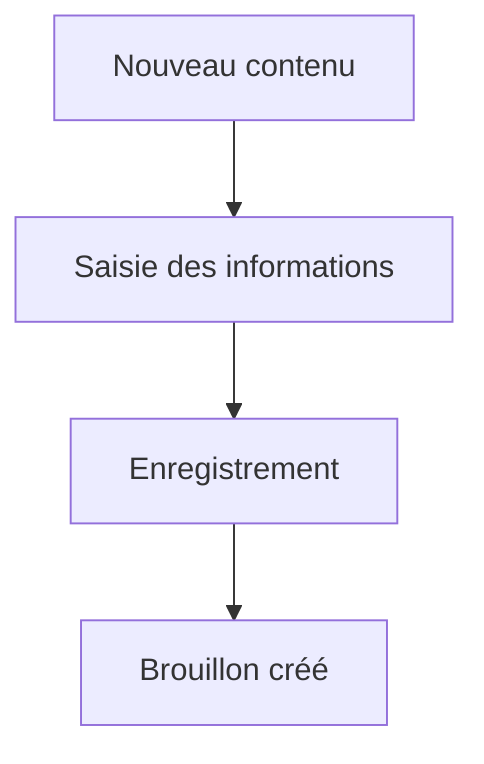
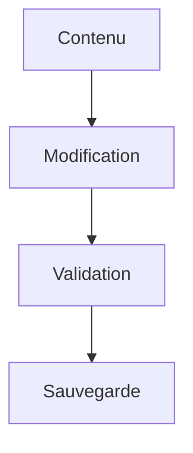
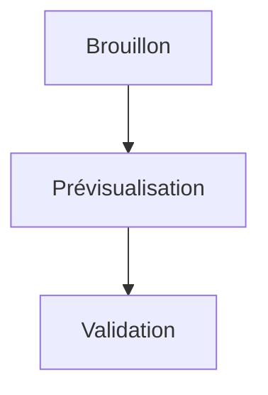
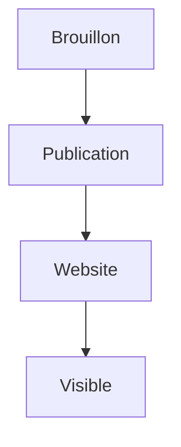
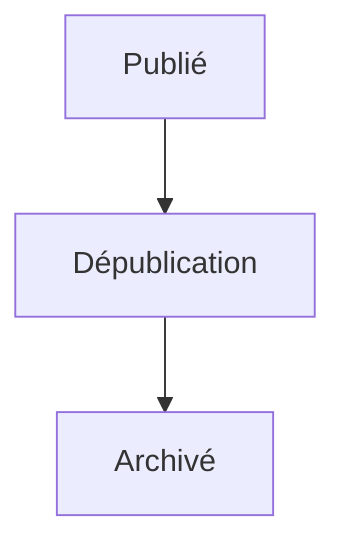
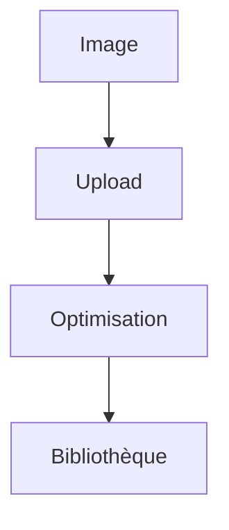
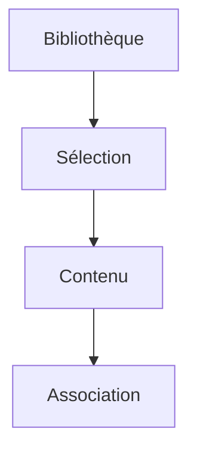
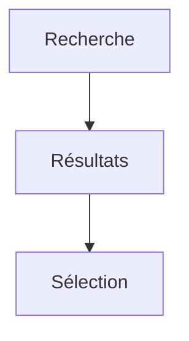
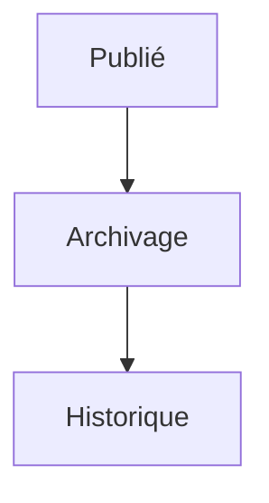
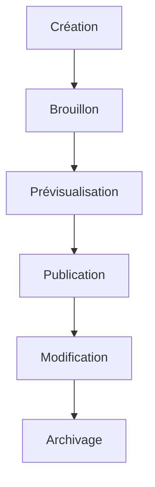

# User Flows — CMS

> Produit : Zawena Platform
>
> Module : CMS (Content Management System)
>
> Identifiant : USER-FLOWS-CMS
>
> Version : 1.0
>
> Statut : MVP
>
> Dernière mise à jour : 02 Août 2026
>
> Propriétaire : Product Management – Zawena

---

# Table des matières

1. Objectif
2. Vue d'ensemble
3. Acteurs
4. Workflows
5. Cas alternatifs
6. Cas d'erreur
7. KPIs
8. Dépendances
9. Références

---

# 1. Objectif

Décrire les workflows liés à la création, la gestion, la publication et l'archivage des contenus du site web Zawena.

Le CMS permet aux administrateurs de maintenir le contenu du site sans intervention technique.

---

# 2. Vue d'ensemble

Le CMS permet de gérer :

- les pages du site ;
- les services ;
- les articles du blog ;
- les études de cas ;
- la FAQ ;
- les contenus légaux ;
- les médias ;
- le référencement SEO.

---

# 3. Acteurs

## Acteurs principaux

- Administrator
- Super Administrator

## Acteurs secondaires

- Website
- Media Library
- SEO Engine
- Notification Engine

---

# 4. Workflows

---

# FLOW-CMS-001 — Créer un contenu

## Objectif

Créer une nouvelle page ou un nouvel article.

### Préconditions

- Utilisateur authentifié
- Permissions CMS

### Déclencheur

Clique sur « Nouveau contenu ».

### Diagramme



### États

Brouillon

↓

Publié

↓

Archivé

### APIs

POST /cms/content

### Événements

content.created

---

# FLOW-CMS-002 — Modifier un contenu



### APIs

PATCH /cms/content/{id}

### Événements

content.updated

---

# FLOW-CMS-003 — Prévisualiser un contenu



---

# FLOW-CMS-004 — Publier un contenu



### États

Brouillon

↓

Publié

### APIs

POST /cms/content/{id}/publish

### Événements

content.published

### Notifications

Administrateur

---

# FLOW-CMS-005 — Dépublier un contenu



---

# FLOW-CMS-006 — Téléverser un média



### APIs

POST /media/upload

### Événements

media.uploaded

---

# FLOW-CMS-007 — Associer un média



---

# FLOW-CMS-008 — Optimiser le SEO

```mermaid
flowchart TD

Contenu

-->

Titre SEO

-->

Meta Description

-->

Slug

-->

Publication
```

---

# FLOW-CMS-009 — Rechercher un contenu



---

# FLOW-CMS-010 — Archiver un contenu



---

# FLOW-CMS-011 — Cycle de vie complet



---

# 5. Cas alternatifs

## Publication programmée

↓

Planification

↓

Publication automatique

---

## Brouillon abandonné

↓

Conservation

↓

Suppression manuelle

---

## Média déjà existant

↓

Réutilisation

---

# 6. Cas d'erreur

Échec d'upload

↓

Nouvel envoi

---

Erreur de publication

↓

Retour brouillon

---

Image invalide

↓

Message d'erreur

---

# 7. KPIs

- Nombre de contenus publiés
- Nombre de brouillons
- Temps moyen avant publication
- Nombre de médias téléversés
- Nombre de pages archivées
- Score SEO moyen

---

# 8. Dépendances

- docs/product/features/cms.md
- docs/product/user-stories/cms.md
- docs/product/user-flows/visitor.md
- docs/architecture/api.md
- docs/architecture/database.md

---

# 9. Références

- CMS Feature Specification
- CMS User Stories
- Website User Flows
- Architecture API
- Design System

---