# User Flows — CRM

> Produit : Zawena Platform
>
> Module : CRM
>
> Identifiant : USER-FLOWS-CRM
>
> Version : 1.0
>
> Statut : MVP
>
> Dernière mise à jour : 02 Août 2026
>
> Propriétaire : Product Management – Zawena

---

# Table des matières

1. Objectif
2. Vue d'ensemble
3. Acteurs
4. Workflows
5. Cas alternatifs
6. Cas d'erreur
7. Dépendances
8. Références

---

# 1. Objectif

Décrire les différents workflows du CRM de Zawena Platform.

Le CRM est responsable de la gestion complète du cycle commercial, depuis la création d'un Lead jusqu'à la création d'un Projet.

---

# 2. Vue d'ensemble

Le CRM gère les objets métier suivants :

- Lead
- Prospect
- Entreprise
- Contact
- Opportunité
- Activité
- Note
- Devis

---

# 3. Acteurs

## Acteurs principaux

- Sales
- Administrator

## Acteurs secondaires

- Website
- Client
- Notification Engine
- Quote Module
- Projects Module
- Database

---

# 4. Workflows

---

# FLOW-CRM-001 — Création d'un Lead

## Objectif

Créer un nouveau Lead provenant du site web ou d'une saisie manuelle.

### Préconditions

- Utilisateur authentifié (création manuelle)
- ou formulaire Website valide

### Déclencheur

- Soumission du formulaire de contact
- Import CSV
- Création manuelle

### Diagramme

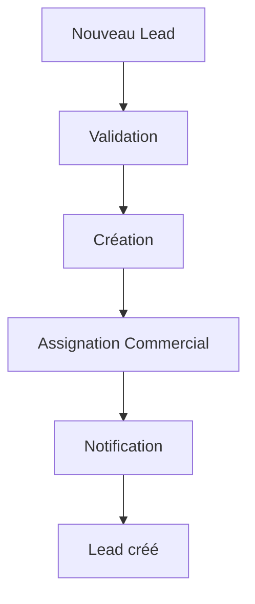

### Résultat attendu

Le Lead est créé avec le statut **Nouveau**.

### APIs

POST /crm/leads

### Événements

lead.created

### Notifications

Sales responsable

---

# FLOW-CRM-002 — Qualification d'un Lead

## Objectif

Déterminer si un Lead est suffisamment qualifié.

### Diagramme

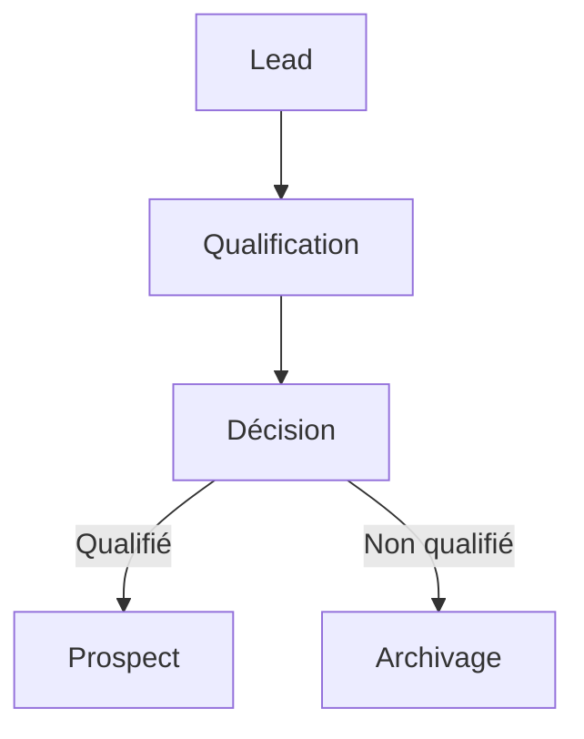

### APIs

PATCH /crm/leads/{id}

### Événements

lead.qualified

---

# FLOW-CRM-003 — Conversion en Prospect

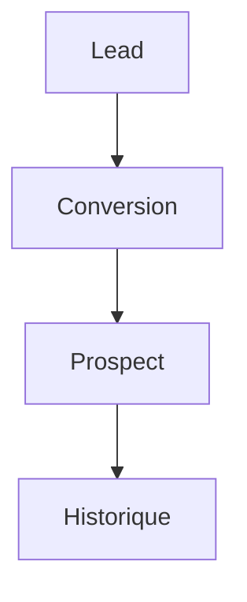

### Résultat

Le Lead devient Prospect.

---

# FLOW-CRM-004 — Création d'une Entreprise

```mermaid
flowchart TD

Prospect

-->

Entreprise

-->

Base CRM
```

---

# FLOW-CRM-005 — Ajout d'un Contact

```mermaid
flowchart TD

Entreprise

-->

Nouveau Contact

-->

Association

-->

Sauvegarde
```

---

# FLOW-CRM-006 — Création d'une Opportunité

## Objectif

Créer une opportunité commerciale.

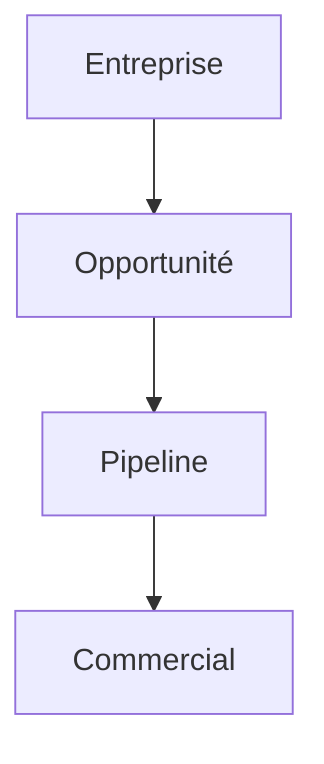

### APIs

POST /crm/opportunities

### Événements

opportunity.created

---

# FLOW-CRM-007 — Déplacement dans le Pipeline

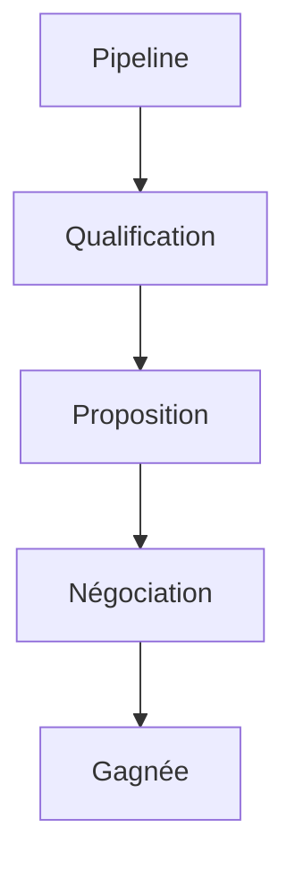

ou

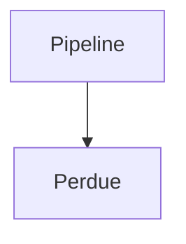

---

# FLOW-CRM-008 — Planification d'une Activité

```mermaid
flowchart TD

Opportunité

-->

Créer Activité

-->

Agenda

-->

Notification
```

---

# FLOW-CRM-009 — Ajout d'une Note

```mermaid
flowchart TD

Entreprise

-->

Nouvelle Note

-->

Historique
```

---

# FLOW-CRM-010 — Création d'un Devis

```mermaid
flowchart TD

Opportunité

-->

Créer Devis

-->

Module Quotes

-->

Brouillon
```

---

# FLOW-CRM-011 — Opportunité gagnée

```mermaid
flowchart TD

Devis Accepté

-->

Opportunité Gagnée

-->

Projet
```

### Événements

opportunity.won

project.created

---

# FLOW-CRM-012 — Opportunité perdue

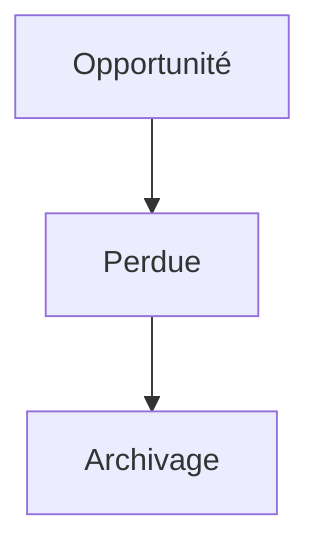

---

# FLOW-CRM-013 — Recherche CRM

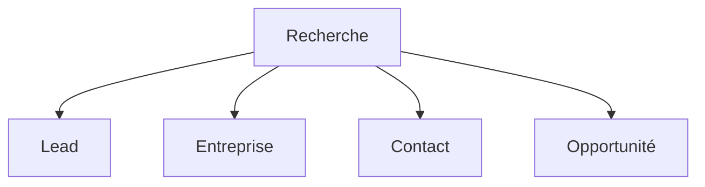

---

# FLOW-CRM-014 — Dashboard Commercial

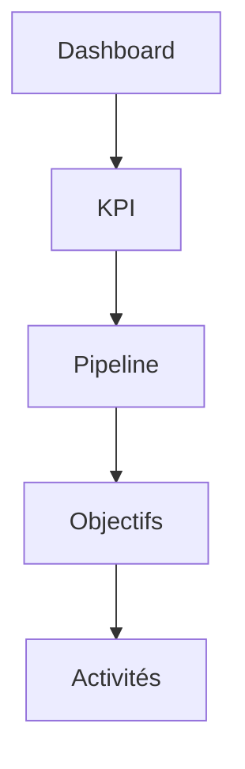

---

# FLOW-CRM-015 — Export CRM

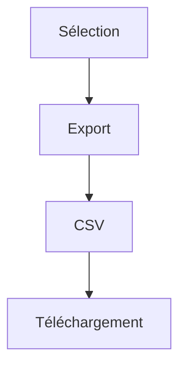

---

# FLOW-CRM-016 — Historique d'une entreprise

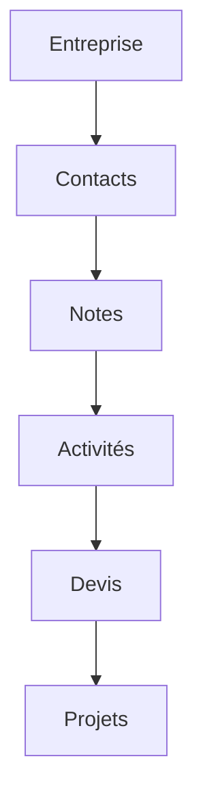

---

# FLOW-CRM-017 — Synchronisation CRM

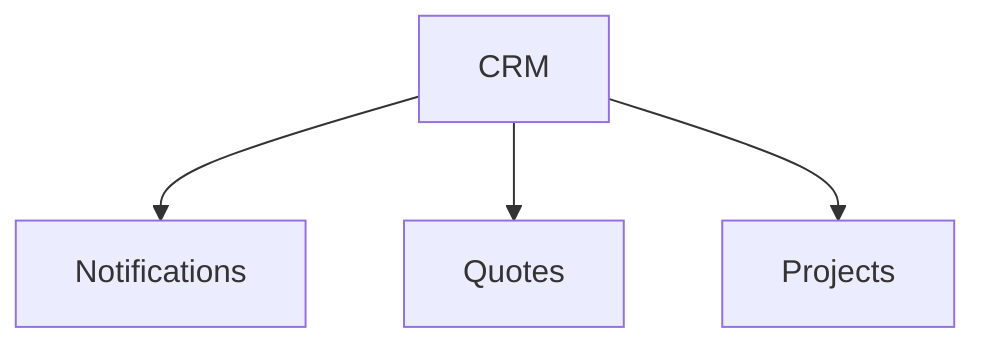

---

# FLOW-CRM-018 — Cycle commercial complet

```mermaid
flowchart TD

Website

-->

Lead

-->

Prospect

-->

Entreprise

-->

Contact

-->

Opportunité

-->

Devis

-->

Contrat

-->

Projet

-->

Client Portal
```

---

# 5. Cas alternatifs

## Lead en doublon

↓

Fusion

---

## Entreprise existante

↓

Réutilisation

---

## Contact existant

↓

Association

---

## Devis refusé

↓

Retour Négociation

---

# 6. Cas d'erreur

Validation impossible

↓

Correction

---

Erreur API

↓

Nouvelle tentative

---

Conflit de données

↓

Historique

↓

Résolution

---

# 7. Dépendances

- docs/product/features/crm.md
- docs/product/features/quotes.md
- docs/product/features/projects.md
- docs/product/user-stories/crm.md
- docs/architecture/database.md
- docs/architecture/api.md

---

# 8. Références

- CRM Feature Specification
- CRM User Stories
- Quotes Feature Specification
- Projects Feature Specification
- Architecture Database
- Business Rules

---