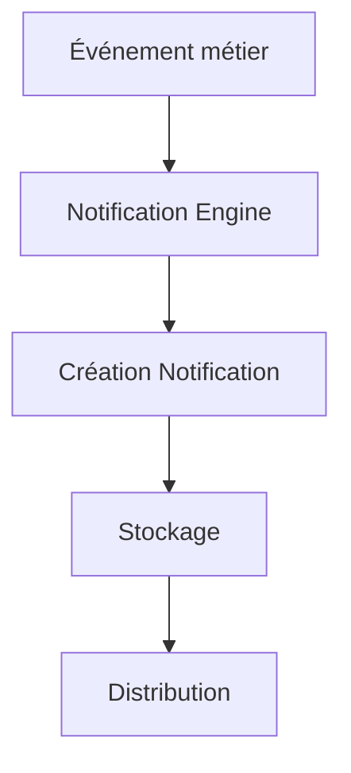
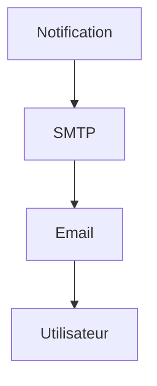
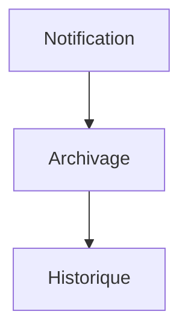
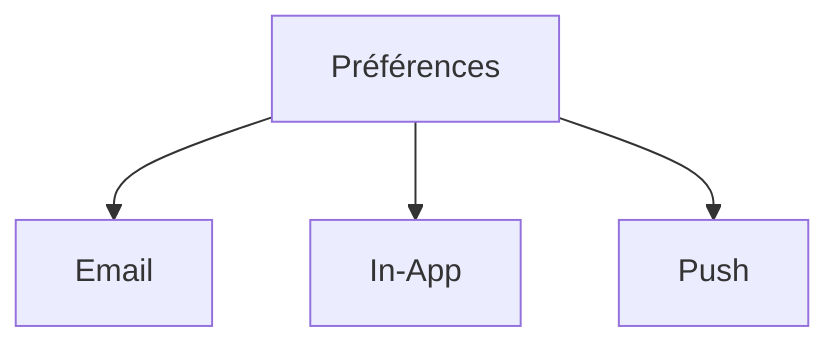
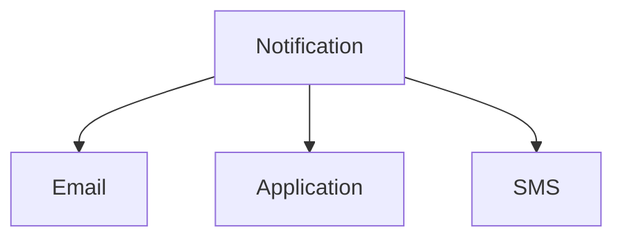
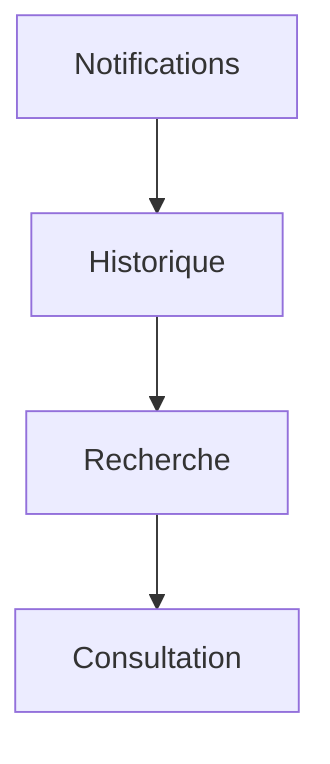

# User Flows — Notifications

> Produit : Zawena Platform
>
> Module : Notifications
>
> Identifiant : USER-FLOWS-NOTIFICATIONS
>
> Version : 1.0
>
> Statut : MVP
>
> Dernière mise à jour : 02 Août 2026
>
> Propriétaire : Product Management – Zawena

---

# Table des matières

1. Objectif
2. Vue d'ensemble
3. Acteurs
4. Workflows
5. Cas alternatifs
6. Cas d'erreur
7. KPIs
8. Dépendances
9. Références

---

# 1. Objectif

Décrire le fonctionnement du moteur de notifications de Zawena Platform.

Le module Notifications centralise tous les événements générés par les différents modules afin d'informer les utilisateurs au bon moment via différents canaux de communication.

---

# 2. Vue d'ensemble

Le moteur de notifications permet :

- générer des notifications automatiques ;
- envoyer des emails ;
- afficher les notifications dans l'application ;
- gérer les préférences utilisateur ;
- historiser les événements ;
- suivre la lecture des notifications.

---

# 3. Acteurs

## Acteurs principaux

- Tous les utilisateurs authentifiés

## Acteurs secondaires

- CRM
- Projects
- Quotes
- CMS
- Authentication
- SMTP
- Notification Engine

---

# 4. Workflows

---

# FLOW-NOTIF-001 — Génération d'une notification

## Objectif

Créer automatiquement une notification lorsqu'un événement métier est déclenché.

### Préconditions

- Événement métier valide
- Destinataire identifié

### Déclencheur

Émission d'un événement métier.

### Diagramme



### États

Créée

↓

En attente

↓

Envoyée

↓

Lue

↓

Archivée

### APIs

POST /notifications

### Événements

notification.created

---

# FLOW-NOTIF-002 — Notification In-App

```mermaid
flowchart TD

Notification

-->

Centre de notifications

-->

Utilisateur

-->

Lecture
```

### APIs

GET /notifications

---

# FLOW-NOTIF-003 — Notification Email



### APIs

POST /notifications/email

### Événements

notification.email.sent

---

# FLOW-NOTIF-004 — Marquer comme lue

```mermaid
flowchart TD

Notification

-->

Lecture

-->

Statut Lu

-->

Historique
```

### APIs

PATCH /notifications/{id}/read

### Événements

notification.read

---

# FLOW-NOTIF-005 — Marquer toutes comme lues

```mermaid
flowchart TD

Notifications

-->

Tout sélectionner

-->

Marquer comme lu
```

---

# FLOW-NOTIF-006 — Archiver une notification



### États

Lue

↓

Archivée

---

# FLOW-NOTIF-007 — Gestion des préférences



### APIs

PATCH /notifications/preferences

---

# FLOW-NOTIF-008 — Distribution multicanale



> **Note MVP :** le canal SMS est prévu pour une version ultérieure. Le MVP utilise uniquement les notifications In-App et Email.

---

# FLOW-NOTIF-009 — Relance automatique

```mermaid
flowchart TD

Notification non lue

-->

Temporisation

-->

Relance

-->

Nouvel envoi
```

### Événements

notification.reminder.sent

---

# FLOW-NOTIF-010 — Historique des notifications



---

# FLOW-NOTIF-011 — Suppression automatique

```mermaid
flowchart TD

Notification archivée

-->

Rétention atteinte

-->

Suppression automatique
```

---

# FLOW-NOTIF-012 — Cycle de vie complet

```mermaid
flowchart TD

Événement métier

-->

Notification créée

-->

Distribution

-->

Lecture

-->

Archivage

-->

Suppression
```

---

# 5. Cas alternatifs

## Utilisateur hors ligne

↓

Notification conservée

↓

Affichage à la prochaine connexion

---

## Notifications désactivées

↓

Aucune notification envoyée sur le canal désactivé

↓

Historique conservé

---

## Email invalide

↓

Échec d'envoi

↓

Journalisation

---

# 6. Cas d'erreur

Erreur SMTP

↓

Nouvelle tentative

↓

Journalisation

---

Erreur API

↓

Nouvelle tentative

---

Notification introuvable

↓

Erreur 404

---

# 7. KPIs

- Nombre total de notifications envoyées
- Taux de lecture
- Temps moyen avant lecture
- Taux de livraison des emails
- Nombre de notifications archivées
- Nombre d'échecs d'envoi
- Délai moyen de traitement
- Répartition par canal (In-App / Email)

---

# 8. Dépendances

- docs/product/features/notifications.md
- docs/product/user-stories/notifications.md
- docs/product/user-flows/authentication.md
- docs/product/user-flows/projects.md
- docs/product/user-flows/crm.md
- docs/architecture/api.md
- docs/architecture/database.md

---

# 9. Références

- Notifications Feature Specification
- Notifications User Stories
- Architecture API
- Security Policy
- Business Rules

---