# User Flows — Projects

> Produit : Zawena Platform
>
> Module : Projects
>
> Identifiant : USER-FLOWS-PROJECTS
>
> Version : 1.0
>
> Statut : MVP
>
> Dernière mise à jour : 02 Août 2026
>
> Propriétaire : Product Management – Zawena

---

# Table des matières

1. Objectif
2. Vue d'ensemble
3. Acteurs
4. Workflows
5. Cas alternatifs
6. Cas d'erreur
7. Dépendances
8. Références

---

# 1. Objectif

Décrire les workflows liés à la gestion des projets.

Le module Projects permet de planifier, exécuter, suivre et clôturer les projets réalisés pour les clients.

---

# 2. Vue d'ensemble

Le module gère :

- les projets ;
- les équipes ;
- les phases ;
- les jalons ;
- les tâches ;
- les sous-tâches ;
- les livrables ;
- les documents ;
- les discussions ;
- les activités.

---

# 3. Acteurs

## Acteurs principaux

- Project Manager
- Developer

## Acteurs secondaires

- Client
- Administrator
- CRM
- Quotes
- Notification Engine

---

# 4. Workflows

---

# FLOW-PROJ-001 — Création d'un projet

## Objectif

Créer un projet à partir d'un devis accepté.

### Préconditions

- Devis accepté
- Client existant
- Chef de projet disponible

### Déclencheur

Validation commerciale.

### Diagramme

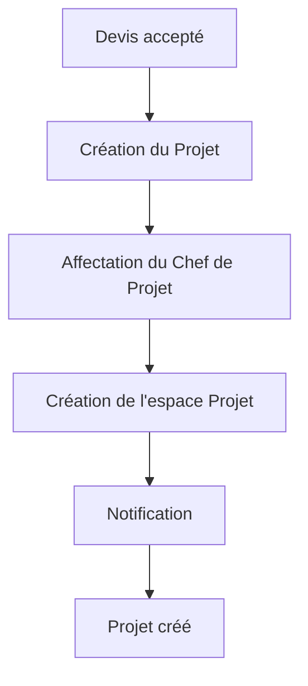

### États

Brouillon

↓

Planifié

↓

En cours

↓

Terminé

↓

Archivé

### APIs

POST /projects

### Événements

project.created

### Notifications

Project Manager

Client

---

# FLOW-PROJ-002 — Constitution de l'équipe

```mermaid
flowchart TD

Projet

-->

Ajout Membres

-->

Attribution Rôles

-->

Validation
```

### États

Équipe incomplète

↓

Équipe constituée

---

# FLOW-PROJ-003 — Création des phases

```mermaid
flowchart TD

Projet

-->

Phase 1

-->

Phase 2

-->

Phase 3

-->

Planning
```

---

# FLOW-PROJ-004 — Création des jalons

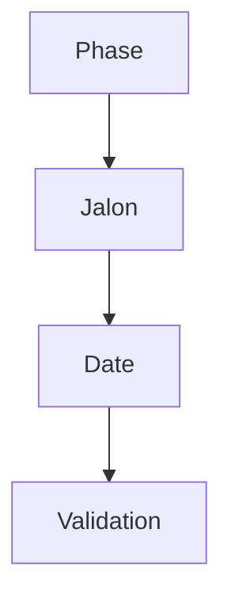

---

# FLOW-PROJ-005 — Création d'une tâche

```mermaid
flowchart TD

Projet

-->

Nouvelle tâche

-->

Assignation

-->

Backlog
```

### États

À faire

↓

En cours

↓

En revue

↓

Terminée

↓

Archivée

---

# FLOW-PROJ-006 — Affectation d'une tâche

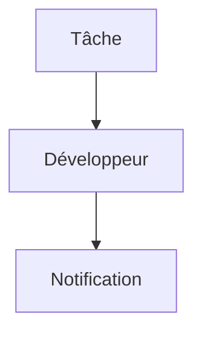

---

# FLOW-PROJ-007 — Changement de statut d'une tâche

```mermaid
flowchart TD

À faire

-->

En cours

-->

En revue

-->

Terminée
```

---

# FLOW-PROJ-008 — Gestion des sous-tâches

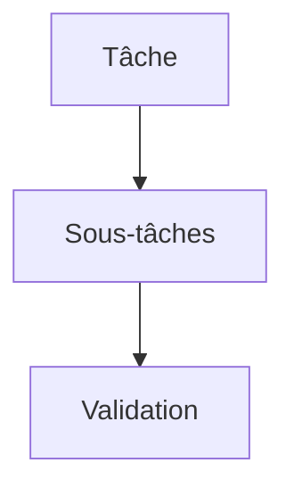

---

# FLOW-PROJ-009 — Gestion des livrables

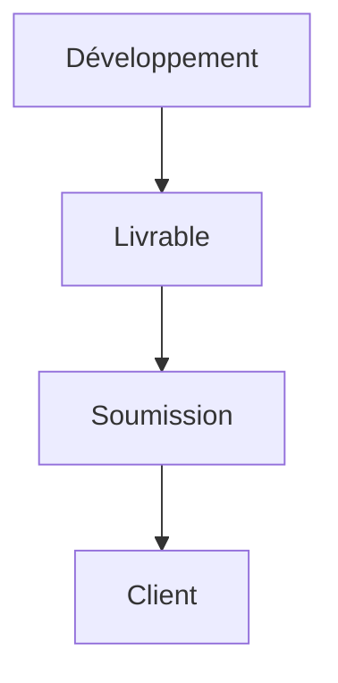

### États

Brouillon

↓

Soumis

↓

En validation

↓

Accepté

↓

Refusé

---

# FLOW-PROJ-010 — Validation client

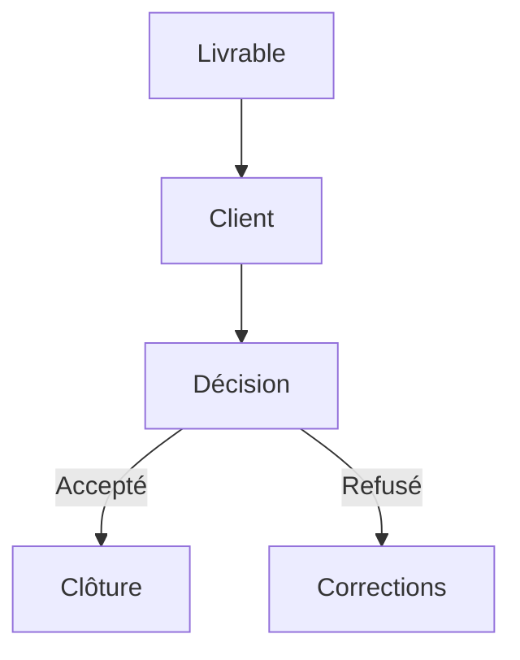

---

# FLOW-PROJ-011 — Gestion documentaire

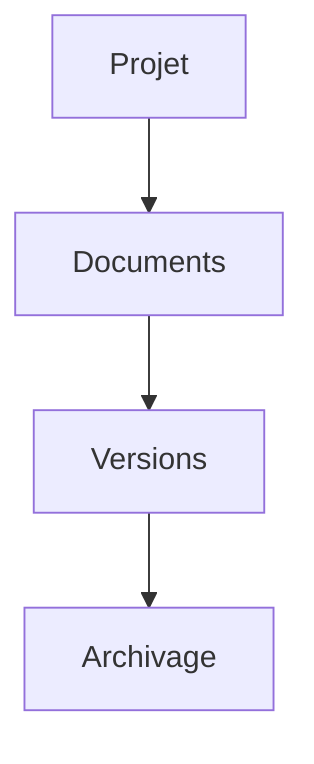

---

# FLOW-PROJ-012 — Commentaires

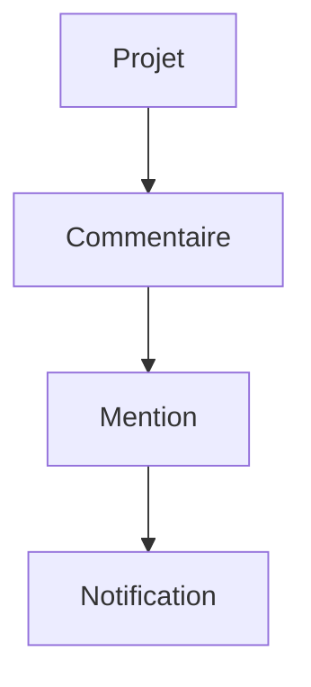

---

# FLOW-PROJ-013 — Tableau Kanban

```mermaid
flowchart TD

Backlog

-->

À faire

-->

En cours

-->

Revue

-->

Terminé
```

---

# FLOW-PROJ-014 — Calendrier

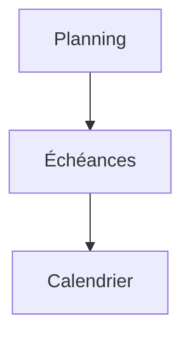

---

# FLOW-PROJ-015 — Timeline

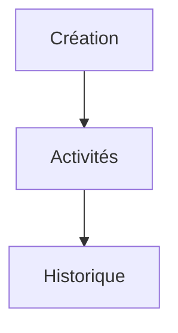

---

# FLOW-PROJ-016 — Clôture d'un projet

```mermaid
flowchart TD

Projet terminé

-->

Validation finale

-->

Archivage

-->

Client Portal
```

### États

En cours

↓

Terminé

↓

Archivé

---

# FLOW-PROJ-017 — Cycle de vie complet

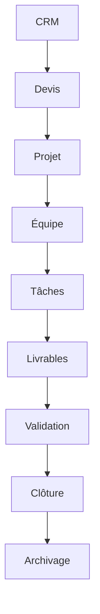

---

# 5. Cas alternatifs

## Livrable refusé

↓

Retour développement

---

## Développeur indisponible

↓

Réaffectation

---

## Projet suspendu

↓

Statut Suspendu

↓

Reprise

---

## Jalon reporté

↓

Replanification

---

# 6. Cas d'erreur

Échec API

↓

Nouvelle tentative

---

Conflit de version

↓

Fusion

↓

Validation

---

Document introuvable

↓

Notification

---

# 7. Dépendances

- docs/product/features/projects.md
- docs/product/user-stories/projects.md
- docs/product/user-flows/crm.md
- docs/product/user-flows/client.md
- docs/architecture/database.md
- docs/architecture/api.md

---

# 8. Références

- Projects Feature Specification
- Projects User Stories
- CRM User Flows
- Architecture Database
- Architecture API
- Business Rules

---