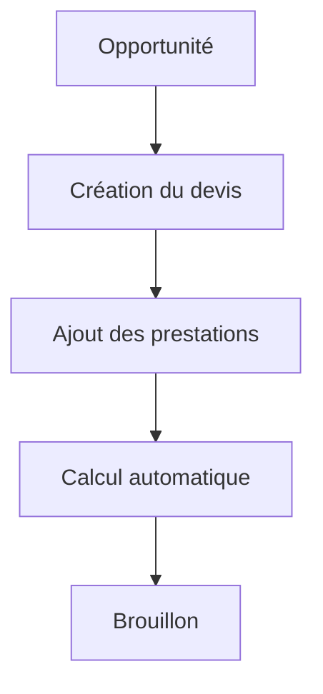
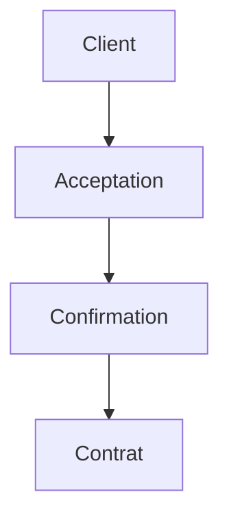
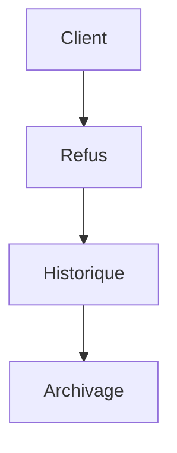

# User Flows — Quotes

> Produit : Zawena Platform
>
> Module : Quotes
>
> Identifiant : USER-FLOWS-QUOTES
>
> Version : 1.0
>
> Statut : MVP
>
> Dernière mise à jour : 02 Août 2026
>
> Propriétaire : Product Management – Zawena

---

# Table des matières

1. Objectif
2. Vue d'ensemble
3. Acteurs
4. Workflows
5. Cas alternatifs
6. Cas d'erreur
7. Dépendances
8. Références

---

# 1. Objectif

Décrire les parcours liés à la création, la gestion, l'envoi, la validation et la transformation d'un devis.

Le module Quotes assure la transition entre le processus commercial et le lancement d'un projet.

---

# 2. Vue d'ensemble

Le module couvre :

- création du devis ;
- édition ;
- génération PDF ;
- validation interne ;
- envoi au client ;
- négociation ;
- acceptation ;
- refus ;
- création du contrat ;
- création du projet.

---

# 3. Acteurs

## Acteurs principaux

- Sales
- Administrator

## Acteurs secondaires

- Client
- CRM
- Projects
- Notification Engine
- Générateur PDF

---

# 4. Workflows

---

# FLOW-QUOTE-001 — Création d'un devis

## Objectif

Créer un devis à partir d'une opportunité commerciale.

### Préconditions

- Opportunité existante
- Entreprise existante
- Contact principal défini

### Déclencheur

Le commercial clique sur « Nouveau devis ».

### Diagramme



### États

Brouillon

↓

En validation

↓

Envoyé

↓

Accepté

↓

Archivé

### APIs

POST /quotes

### Événements

quote.created

### Notifications

Responsable commercial

---

# FLOW-QUOTE-002 — Ajout des prestations

```mermaid
flowchart TD

Devis

-->

Ajouter prestation

-->

Quantité

-->

Prix

-->

Calcul
```

### États

Édition

↓

Calcul terminé

---

# FLOW-QUOTE-003 — Génération du PDF

```mermaid
flowchart TD

Devis

-->

Génération PDF

-->

Prévisualisation

-->

Téléchargement
```

### APIs

POST /quotes/{id}/pdf

---

# FLOW-QUOTE-004 — Validation interne

```mermaid
flowchart TD

Brouillon

-->

Validation Manager

-->

Décision

Décision -->|Validé| Envoi

Décision -->|Refusé| Retour modification
```

### États

Brouillon

↓

En validation

↓

Validé

---

# FLOW-QUOTE-005 — Envoi au client

```mermaid
flowchart TD

PDF

-->

Email

-->

Client

-->

Confirmation d'envoi
```

### APIs

POST /quotes/{id}/send

### Notifications

Client

Commercial

---

# FLOW-QUOTE-006 — Consultation par le client

```mermaid
flowchart TD

Email

-->

Portail Client

-->

Consultation

-->

Décision
```

### Événements

quote.viewed

---

# FLOW-QUOTE-007 — Négociation

```mermaid
flowchart TD

Client

-->

Commentaires

-->

Commercial

-->

Modification

-->

Nouvelle version
```

### États

Envoyé

↓

En négociation

↓

Nouvelle version

---

# FLOW-QUOTE-008 — Acceptation



### États

Accepté

### APIs

POST /quotes/{id}/accept

### Événements

quote.accepted

---

# FLOW-QUOTE-009 — Refus



### États

Refusé

### Événements

quote.rejected

---

# FLOW-QUOTE-010 — Gestion des versions

```mermaid
flowchart TD

Version 1

-->

Modification

-->

Version 2

-->

Version 3
```

---

# FLOW-QUOTE-011 — Création du contrat

```mermaid
flowchart TD

Devis accepté

-->

Contrat

-->

Validation
```

### Événements

contract.created

---

# FLOW-QUOTE-012 — Création du projet

```mermaid
flowchart TD

Contrat

-->

Projet

-->

Project Manager

-->

Notification
```

### États

Projet créé

### APIs

POST /projects

### Événements

project.created

---

# FLOW-QUOTE-013 — Cycle de vie complet

```mermaid
flowchart TD

CRM

-->

Opportunité

-->

Devis

-->

Validation

-->

Envoi

-->

Acceptation

-->

Contrat

-->

Projet

-->

Client Portal
```

---

# 5. Cas alternatifs

## Le client demande une modification

↓

Nouvelle version

↓

Nouvel envoi

---

## Le devis expire

↓

Statut Expiré

↓

Archivage

---

## Le client ne répond pas

↓

Relance

↓

Négociation

---

# 6. Cas d'erreur

Erreur de génération PDF

↓

Nouvelle tentative

---

Erreur d'envoi email

↓

Nouvel envoi

---

Calcul invalide

↓

Blocage de l'envoi

↓

Correction

---

# 7. Dépendances

- docs/product/features/quotes.md
- docs/product/user-stories/quotes.md
- docs/product/user-flows/crm.md
- docs/product/user-flows/projects.md
- docs/architecture/api.md
- docs/architecture/database.md

---

# 8. Références

- Quotes Feature Specification
- Quotes User Stories
- CRM User Flows
- Projects User Flows
- Architecture API
- Business Rules

---