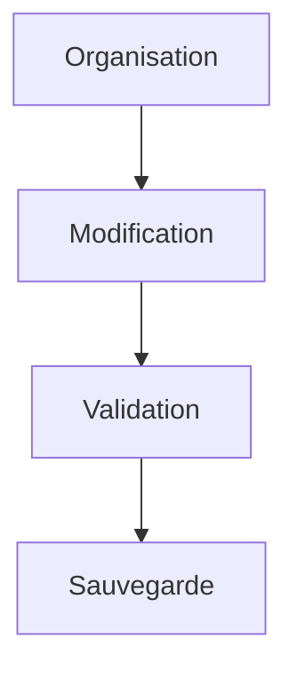
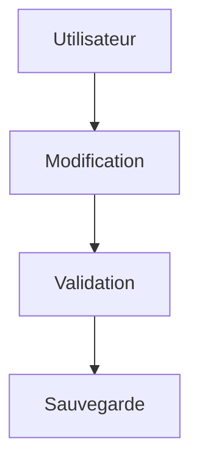
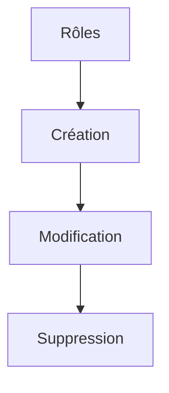
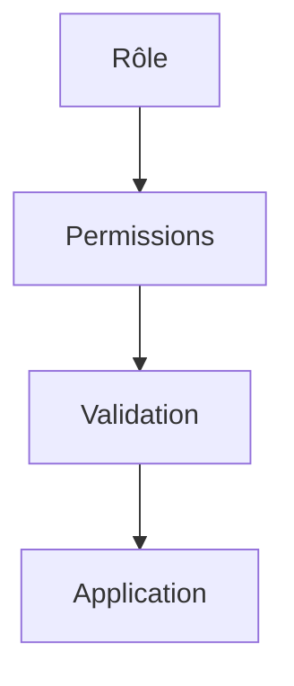
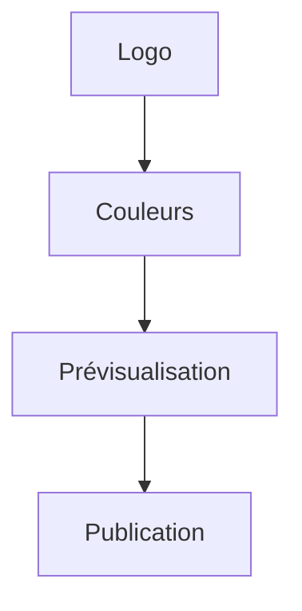
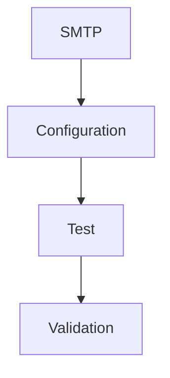
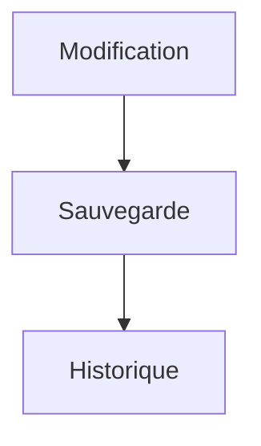
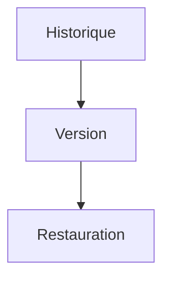
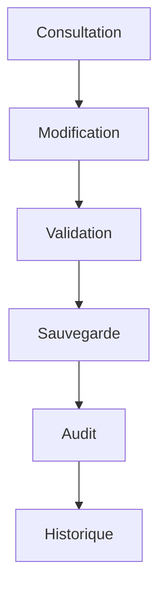

# User Flows — Settings

> Produit : Zawena Platform
>
> Module : Settings
>
> Identifiant : USER-FLOWS-SETTINGS
>
> Version : 1.0
>
> Statut : MVP
>
> Dernière mise à jour : 02 Août 2026
>
> Propriétaire : Product Management – Zawena

---

# Table des matières

1. Objectif
2. Vue d'ensemble
3. Acteurs
4. Workflows
5. Cas alternatifs
6. Cas d'erreur
7. KPIs
8. Dépendances
9. Références

---

# 1. Objectif

Décrire les workflows d'administration et de configuration de Zawena Platform.

Le module Settings permet aux administrateurs de gérer l'organisation, les utilisateurs, les rôles, les paramètres de sécurité, les intégrations, le branding et les préférences globales de la plateforme.

---

# 2. Vue d'ensemble

Le module couvre :

- Organisation
- Utilisateurs
- Rôles
- Permissions
- Sécurité
- Branding
- Intégrations
- IA
- Journaux d'audit
- Préférences

---

# 3. Acteurs

## Acteurs principaux

- Super Administrator
- Administrator

## Acteurs secondaires

- Authentication
- Notification Engine
- OpenAI
- SMTP
- Supabase
- Audit Log

---

# 4. Workflows

---

# FLOW-SET-001 — Modifier les informations de l'organisation

## Objectif

Mettre à jour les informations générales de l'entreprise.

### Préconditions

- Être Administrator.

### Déclencheur

Ouverture des paramètres Organisation.

### Diagramme



### États

Consultation

↓

Modification

↓

Sauvegarde

### APIs

PATCH /settings/organization

### Événements

organization.updated

---

# FLOW-SET-002 — Inviter un utilisateur

```mermaid
flowchart TD

Administrator

-->

Invitation

-->

Email

-->

Activation

-->

Compte créé
```

### APIs

POST /users/invite

### Événements

user.invited

### Notifications

Email d'invitation

---

# FLOW-SET-003 — Modifier un utilisateur



---

# FLOW-SET-004 — Désactiver un utilisateur

```mermaid
flowchart TD

Utilisateur

-->

Désactivation

-->

Confirmation

-->

Compte inactif
```

### États

Actif

↓

Suspendu

↓

Désactivé

---

# FLOW-SET-005 — Gérer les rôles



### APIs

POST /roles

PATCH /roles/{id}

DELETE /roles/{id}

---

# FLOW-SET-006 — Gérer les permissions



### Événements

permissions.updated

---

# FLOW-SET-007 — Configurer la politique de sécurité

```mermaid
flowchart TD

Sécurité

-->

Mot de passe

Sécurité

-->

Sessions

Sécurité

-->

MFA
```

> **Note MVP :** l'authentification multifacteur (MFA) est prévue pour une version ultérieure. Le MVP prend en charge les politiques de mot de passe et la gestion des sessions.

---

# FLOW-SET-008 — Modifier le branding



---

# FLOW-SET-009 — Configurer SMTP



### APIs

PATCH /settings/smtp

---

# FLOW-SET-010 — Configurer le fournisseur IA

```mermaid
flowchart TD

Provider IA

-->

Clé API

-->

Test

-->

Activation
```

### États

Non configuré

↓

Configuré

↓

Actif

### APIs

PATCH /settings/ai

---

# FLOW-SET-011 — Consulter les journaux d'audit

```mermaid
flowchart TD

Audit Log

-->

Recherche

-->

Consultation
```

### APIs

GET /audit

---

# FLOW-SET-012 — Sauvegarder les paramètres



---

# FLOW-SET-013 — Restaurer une configuration



---

# FLOW-SET-014 — Modifier les préférences globales

```mermaid
flowchart TD

Préférences

-->

Langue

Préférences

-->

Fuseau horaire

Préférences

-->

Devise
```

---

# FLOW-SET-015 — Cycle de vie des paramètres



---

# 5. Cas alternatifs

## Invitation expirée

↓

Nouvelle invitation

---

## Clé API invalide

↓

Refus de l'enregistrement

↓

Correction

---

## Paramètre restauré

↓

Historique mis à jour

---

# 6. Cas d'erreur

Erreur API

↓

Nouvelle tentative

---

Conflit de permissions

↓

Accès refusé

---

Erreur de sauvegarde

↓

Annulation

↓

Journalisation

---

# 7. KPIs

- Nombre d'utilisateurs actifs
- Nombre d'utilisateurs invités
- Nombre de rôles configurés
- Nombre de modifications des paramètres
- Nombre d'intégrations actives
- Nombre de changements de permissions
- Nombre d'événements d'audit
- Temps moyen de configuration d'une intégration

---

# 8. Dépendances

- docs/product/features/settings.md
- docs/product/user-stories/settings.md
- docs/product/user-flows/authentication.md
- docs/architecture/api.md
- docs/architecture/database.md
- docs/security/security-policy.md

---

# 9. Références

- Settings Feature Specification
- Settings User Stories
- Authentication User Flows
- Security Policy
- Architecture API
- Business Rules

---